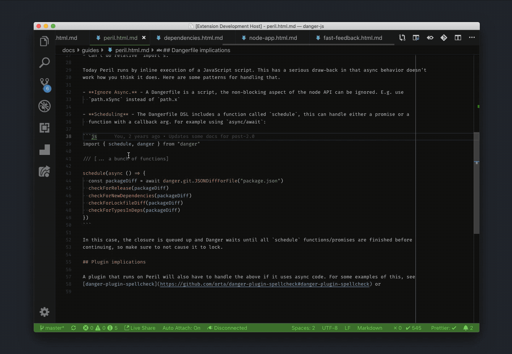

# vscode-ts-markdown-to-playground

## Features

- Adds a link to JavaScript and TypeScript codeblocks in markdown to open in the TypeScript playground.

- Adds a command to open the file or selection in the TypeScript playground
- Very few dependencies
- Is very memory efficient
